# Enterprise Network Infrastructure Simulation (Cisco Packet Tracer)

## Project Overview
This project demonstrates the design and implementation of an enterprise network architecture using **Cisco Packet Tracer**. 

The infrastructure supports four distinct departments with dedicated VLANs, integrated network services (DNS, Web, Email), and secure external connectivity via PAT.

## 🛠️ Technical Stack & Features
- **Network Segmentation:** 4 VLANs (Server, IT, Finance, Guest) to minimize broadcast domains and enhance security.
- **Inter-VLAN Routing:** Configured **Router-on-a-Stick (802.1Q)** for efficient traffic management between subnets.
- **Security Control:** Deployed **Named Extended ACLs** to enforce the "Principle of Least Privilege."
- **Network Services:** Fully functional internal DNS, HTTP (Web), and SMTP/POP3 (Email) servers.
- **Connectivity:** Dynamic IP allocation via **DHCP pools** and secure internet access using **NAT (PAT)**.

## 🌐 Network Topology
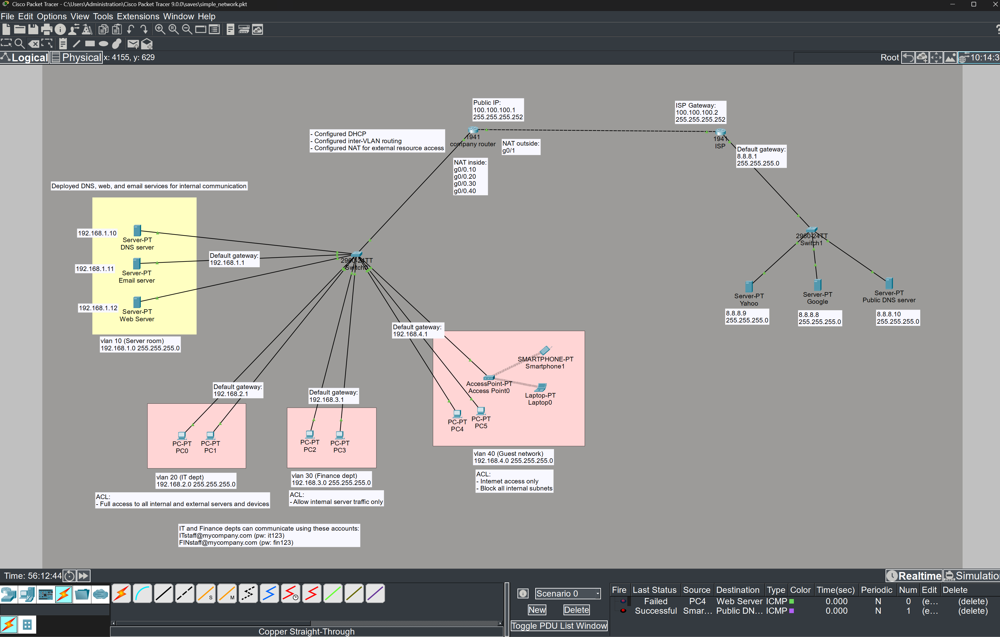

### IP Addressing Plan

| Department | VLAN | Subnet | Gateway |
| :--- | :--- | :--- | :--- |
| Server Room | 10 | 192.168.1.0/24 | 192.168.1.1 |
| IT Dept | 20 | 192.168.2.0/24 | 192.168.2.1 |
| Finance Dept | 30 | 192.168.3.0/24 | 192.168.3.1 |
| Guest Network | 40 | 192.168.4.0/24 | 192.168.4.1 |

### VLAN Configuration
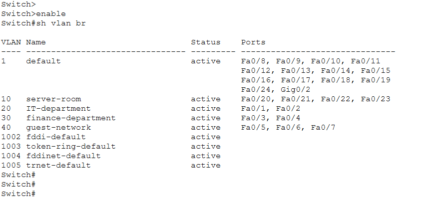

## 🚀 Key Implementations

### Dynamic IP allocation (DHCP)
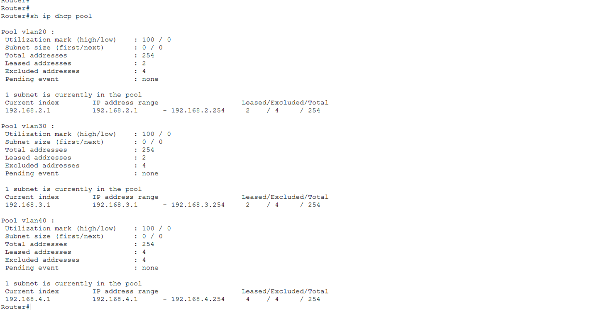

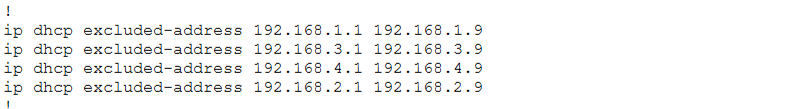

### External Connectivity (PAT)
To enable secure internet access, I implemented Port Address Translation (PAT), allowing multiple internal private IP addresses to share a single public IP address.

- Inside Interfaces: g0/0.10, g0/0.20, g0/0.30, g0/0.40  
- Outside Interface: g0/1 (connected to ISP)  
- NAT Type: Dynamic NAT with Overload (PAT)

This ensures that internal IP addresses (192.168.x.x) are not exposed to external networks, enhancing security while maintaining full connectivity.

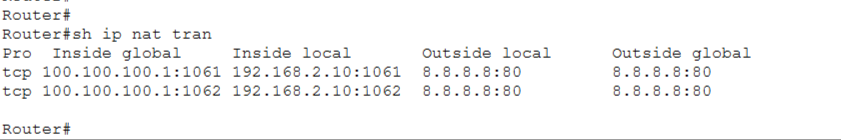

## 🛡️ Security Implementation (ACL Policies)
I implemented granular access control to ensure departmental isolation:
- **IT Dept (VLAN 20):** Full access to internal and external resources for administrative purposes.
- **Finance Dept (VLAN 30):** Restricted to internal Server Room access only; strictly blocked from the Internet and other departments.
- **Guest Network (VLAN 40):** Permitted for external internet access only, and completely isolated from all internal corporate subnets.

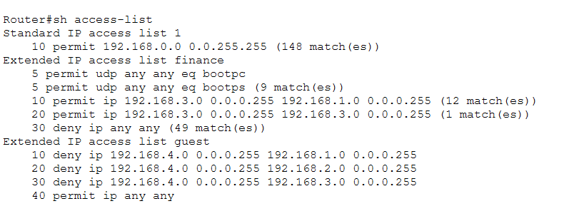

## ☁️ Network Services
I deployed internal DNS, HTTP, and SMTP/POP3 servers to support seamless departmental operations while enforcing strict security policies to ensure network integrity.

### DNS + HTTP Services
Internal devices are configured to access local and external web resources according to their **pre-configured access policies (ACLs)**:

*   **Internal Portal:** `localserver.com`
*   **External Domains:** `google.com`, `yahoo.com`

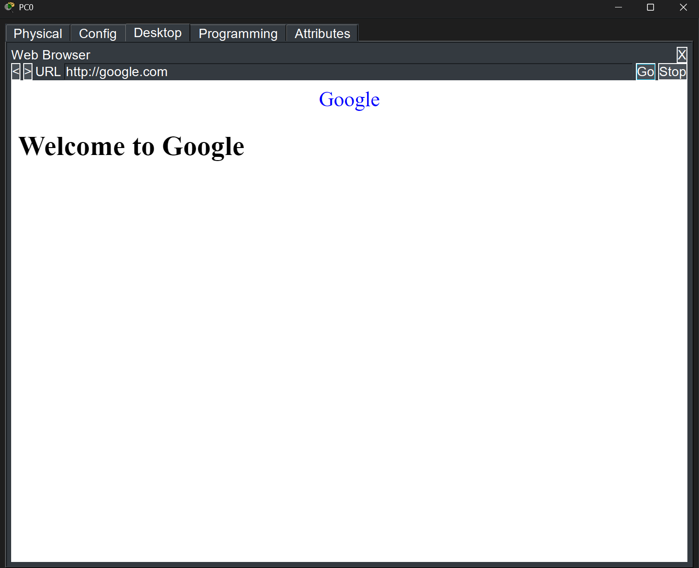

### SMTP/POP3 Services
The IT and Finance departments can communicate using these pre-configured accounts:

| Department | Email Address | Password |
| :--- | :--- | :--- |
| 👨‍💻 **IT Staff** | `ITstaff@mycompany.com` | `it123` |
| 💰 **Finance Staff** | `FINstaff@mycompany.com` | `fin123` |

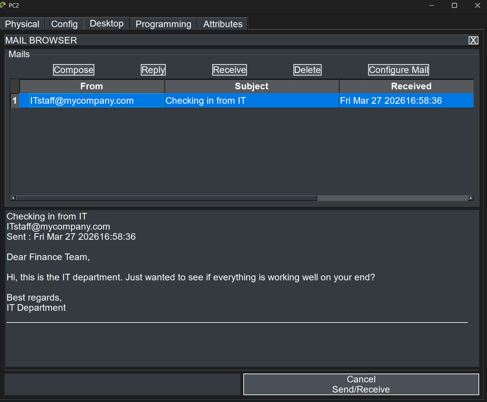

## 🏢 Physical Infrastructure
To simulate a real-world enterprise environment, I implemented a **Multi-Site Physical Topology**:

*   **Offices:** All core networking hardware (Router/Switch) is **Rack-mounted** in a secured **Wiring Closet**.

    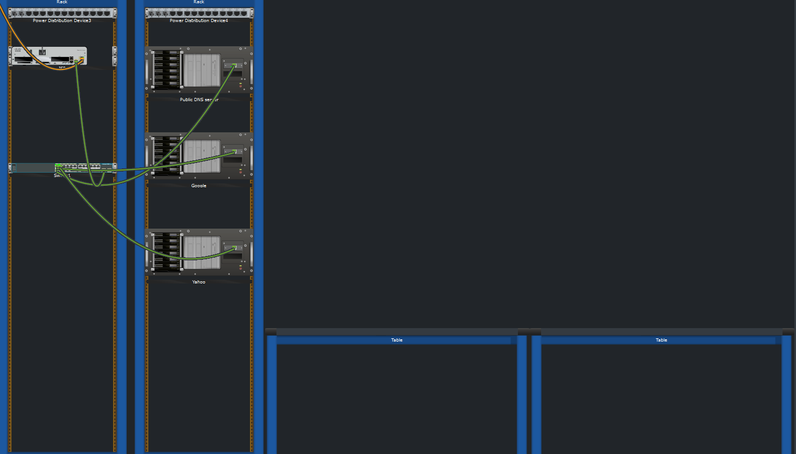
*   **Departmental Layout:** Workstations for IT, Finance, and Guests are placed in separate physical office rooms, connected via **Structured Cabling** to the central switch.

    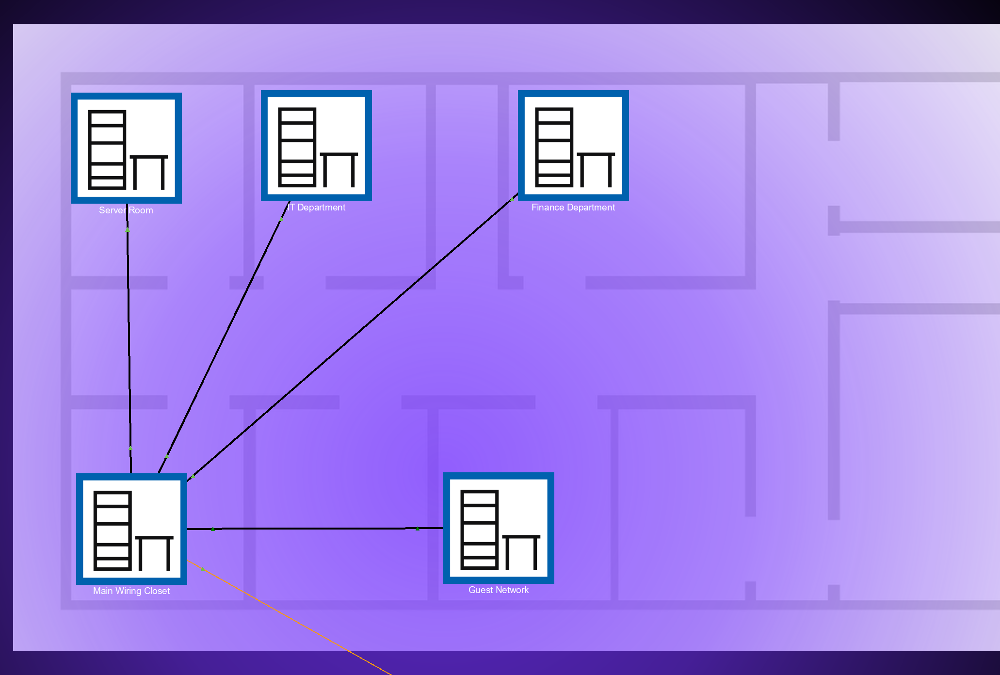
*   **ISP Data Center (Remote):** Public servers (DNS/Web) are deployed in a **separate city-level entity** to simulate true **Wide Area Network (WAN)** connectivity and latency.

    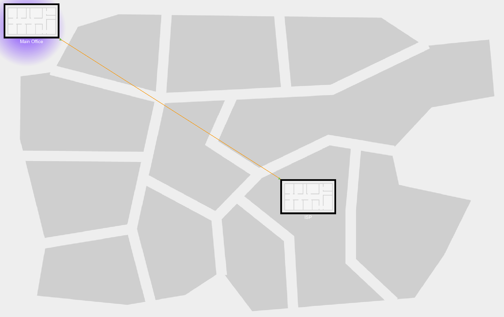

## 📄 Configuration Files
For a detailed technical review of the network logic, the full running configurations are available here:

*   **Core Router:** [`configs/router.txt`](./configs/router.txt)
*   **Distribution Switch:** [`configs/switch.txt`](./configs/switch.txt)

## 👨‍💻 Author
**Lam Cho Tsun, Daniel**  
*BEng in Computer Science (Year 3) @ **The University of Hong Kong (HKU)***

*Interested in Networking and Cybersecurity.*

## ⚖️ License
This project is licensed under the [MIT License](LICENSE).